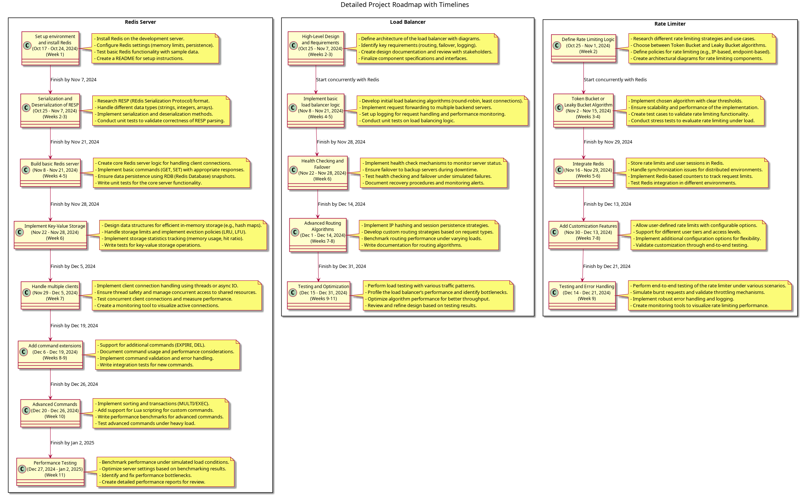

# Project Roadmap

<!-- Project roadmap detailed -->

## Project Descriptions

## 1. Redis Server Clone Project - Detailed Milestones

### Milestone 1: Set up environment and install Redis (1 week)

- **Task 1.1:** Set up local development environment (Day 1-2).
- **Task 1.2:** Install Redis for reference (Day 3-4).
- **Task 1.3:** Familiarize with RESP protocol and Redis internals (Day 5-7).

### Milestone 2: Serialization and Deserialization of RESP Messages (2 weeks)

- **Task 2.1:** Research RESP format and parsing techniques (Day 1-3).
- **Task 2.2:** Implement serialization logic (Day 4-7).
- **Task 2.3:** Implement deserialization logic (Day 8-11).
- **Task 2.4:** Write test cases for message parsing (Day 12-14).

### Milestone 3: Build basic Redis server (3 weeks)

- **Task 3.1:** Develop the main server loop for handling requests (Day 1-4).
- **Task 3.2:** Implement command parsing logic (Day 5-8).
- **Task 3.3:** Add handling for basic PING command (Day 9-11).
- **Task 3.4:** Add handling for ECHO command (Day 12-14).
- **Task 3.5:** Unit test server communication (Day 15-21).

### Milestone 4: Implement Key-Value Storage (SET and GET) (2 weeks)

- **Task 4.1:** Choose data structure for in-memory key-value store (Day 1-2).
- **Task 4.2:** Implement SET command (Day 3-5).
- **Task 4.3:** Implement GET command (Day 6-8).
- **Task 4.4:** Integrate both commands into the main server loop (Day 9-10).
- **Task 4.5:** Write tests for the SET and GET commands (Day 11-14).

### Milestone 5: Handle multiple concurrent clients (2 weeks)

- **Task 5.1:** Research concurrency models (threads, async IO) (Day 1-2).
- **Task 5.2:** Implement concurrent request handling (Day 3-7).
- **Task 5.3:** Stress-test server with multiple clients (Day 8-10).
- **Task 5.4:** Resolve any concurrency issues (Day 11-14).

### Milestone 6: Add command extensions (EX, PX options) (2 weeks)

- **Task 6.1:** Implement expiry logic for keys (Day 1-4).
- **Task 6.2:** Extend SET command to support EX (seconds) and PX (milliseconds) options (Day 5-7).
- **Task 6.3:** Test expiry feature and edge cases (Day 8-10).
- **Task 6.4:** Optimize performance (Day 11-14).

### Milestone 7: Implement Advanced Commands (EXISTS, DEL, LPUSH, etc.) (3 weeks)

- **Task 7.1:** Implement EXISTS command (Day 1-3).
- **Task 7.2:** Implement DEL command (Day 4-6).
- **Task 7.3:** Implement list operations (LPUSH, RPUSH, etc.) (Day 7-12).
- **Task 7.4:** Write integration tests for all advanced commands (Day 13-21).

### Milestone 8: Performance Testing and Benchmarking (2 weeks)

- **Task 8.1:** Set up benchmarking environment (Day 1-3).
- **Task 8.2:** Run performance tests using Redis Benchmark (Day 4-7).
- **Task 8.3:** Compare results with official Redis (Day 8-10).
- **Task 8.4:** Optimize for memory and latency improvements (Day 11-14).

---

## 2. Load Balancer Project - Detailed Milestones

### Milestone 1: High-Level Design (HLD) and Requirements (2 weeks)

- **Task 1.1:** Define functional requirements (Day 1-3).
- **Task 1.2:** Identify key components (e.g., routing, failover) (Day 4-6).
- **Task 1.3:** Create architecture diagrams (Day 7-10).
- **Task 1.4:** Review design with team (Day 11-14).

### Milestone 2: Implement basic load balancer logic (2 weeks)

- **Task 2.1:** Set up environment (Day 1-2).
- **Task 2.2:** Implement request forwarding to multiple servers (Day 3-7).
- **Task 2.3:** Add basic routing logic (Day 8-10).
- **Task 2.4:** Test simple load balancing with multiple servers (Day 11-14).

### Milestone 3: Implement Health Checking and Failover (2 weeks)

- **Task 3.1:** Design health check mechanism (Day 1-2).
- **Task 3.2:** Implement periodic health checks (Day 3-6).
- **Task 3.3:** Implement failover logic (Day 7-10).
- **Task 3.4:** Test health checking and failover under different scenarios (Day 11-14).

### Milestone 4: Advanced Routing Algorithms (2 weeks)

- **Task 4.1:** Implement round-robin algorithm (Day 1-3).
- **Task 4.2:** Implement least connections algorithm (Day 4-6).
- **Task 4.3:** Add support for weighted round-robin (Day 7-10).
- **Task 4.4:** Test and validate routing behavior (Day 11-14).

### Milestone 5: Testing and Optimization (2 weeks)

- **Task 5.1:** Perform stress testing with various traffic loads (Day 1-5).
- **Task 5.2:** Profile the load balancer’s performance (Day 6-9).
- **Task 5.3:** Optimize for better throughput and lower latency (Day 10-14).

---

## 3. Rate Limiter Project - Detailed Milestones

### Milestone 1: Define Rate Limiting Logic (HLD) (1 week)

- **Task 1.1:** Determine rate limit policies (Day 1-2).
- **Task 1.2:** Define thresholds (requests per IP, endpoint, or time frame) (Day 3-4).
- **Task 1.3:** Create architecture diagrams (Day 5-7).

### Milestone 2: Implement Simple Token Bucket or Leaky Bucket Algorithm (2 weeks)

- **Task 2.1:** Choose algorithm (token bucket or leaky bucket) (Day 1-2).
- **Task 2.2:** Implement basic rate limiting logic (Day 3-7).
- **Task 2.3:** Test simple rate limiting functionality (Day 8-10).
- **Task 2.4:** Debug and improve basic algorithm (Day 11-14).

### Milestone 3: Integrate Redis (or Redis Clone) as Shared Database (2 weeks)

- **Task 3.1:** Set up Redis (or clone) for distributed rate limiting (Day 1-2).
- **Task 3.2:** Implement Redis-based counters to track request limits (Day 3-7).
- **Task 3.3:** Test distributed rate limiting in different environments (Day 8-10).
- **Task 3.4:** Handle synchronization issues (Day 11-14).

### Milestone 4: Add Customization Features (2 weeks)

- **Task 4.1:** Implement per-endpoint rate limiting (Day 1-3).
- **Task 4.2:** Implement per-IP rate limiting (Day 4-6).
- **Task 4.3:** Add configuration options (Day 7-10).
- **Task 4.4:** Test for flexibility and customization (Day 11-14).

### Milestone 5: Testing and Error Handling (2 weeks)

- **Task 5.1:** Perform end-to-end testing of the rate limiter (Day 1-4).
- **Task 5.2:** Simulate burst requests and validate throttling (Day 5-7).
- **Task 5.3:** Implement robust error handling (Day 8-10).
- **Task 5.4:** Final testing and bug fixing (Day 11-14).
